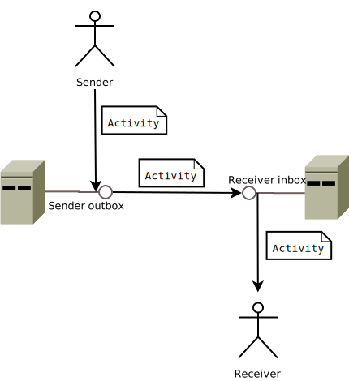
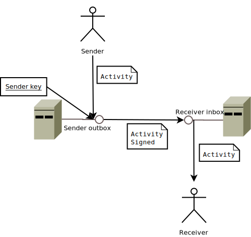
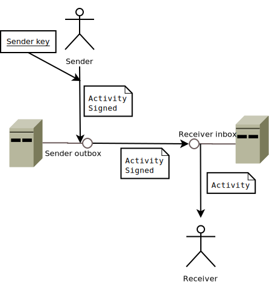

## Activity delivery in ActivityPub
As reported in the [ActivityPub specification](https://www.w3.org/TR/2018/REC-activitypub-20180123/), an ActivityPub server must provide each [`Actor`](https://www.w3.org/TR/activitypub/#actor-objects) with two ['Collection's](https://www.w3.org/TR/activitystreams-vocabulary/#dfn-collection): [`outbox`](https://www.w3.org/TR/activitypub/#outbox) and [`inbox`](https://www.w3.org/TR/activitypub/#inbox). In addition, the addresses of these collections must be listed in the publicly available `Actor` description. 

Let us call _target actors_ of an `Activity` all the `Actor`s to which the `Activity` has to be delivered. Target actors of an activity are specified in the activity itself as described in the specification at [6.1 Client Addressing](https://www.w3.org/TR/activitypub/#client-addressing).

Now let use recall the [Activity](https://www.w3.org/TR/activitystreams-vocabulary/#dfn-activity) delivery process in ActivityPub. 

- Client to Server
  * [CSA] In order to deliver an activity to activity target actors the (user corresponding to) sender `Actor` has to place the activity into the outbox the server provided to her.
  * [CSO] Otherwise, the `Actor` may send to her server an [`Object`](https://www.w3.org/TR/activitystreams-vocabulary/#dfn-object) which cannot be recognized as an `Activity` (see [Note 1](#note1)). This case must be handled by the server, as described in the specification at [6.2.1 Object creation without a Create Activity](https://www.w3.org/TR/activitypub/#object-without-create), with generating a novel `Create` activity _wrapping_ the object sent by the sender, and placing this novel activity in the outbox.
- Server to Server
  * [SS] once that the `Activity` has been placed into the sender outbox, the server sends it to the `inbox`es of all the activity target actors. Notice that some of these inboxes may reside outside the sender server. In these cases we talk about a _Server to Server_ communication, which is described in the specification at [7.1 Delivery](https://www.w3.org/TR/activitypub/#delivery).
 

 
Notice that security mechanisms for both client-to-server and server-to-server communications are not specified in the protocol, as they are left to implementations. The ActivityPub specification refers (in a non-mandatory way) to the [Social Web Community Group Authentication and Authorization best practices report](https://www.w3.org/wiki/SocialCG/ActivityPub/Authentication_Authorization), which effectivelly guided the most part of the ActivityPub implementations currently availabe.

For client to server comunications, the report suggests [OAuth 2](https://oauth.net/2/), which is a well-established authentication and authorization protocol wich, in addition, provides confidentiality features.

For server to server comunications, the approach proposed by the report is to sign messages with [HTTP Signatures](https://tools.ietf.org/html/draft-cavage-http-signatures-08) as follows:
- of course, the headers taken into consideration by the signature must contains at minimun the message content _digest_, see also [Note 2](#note2);
- the message must be signed with a key associated to the sender actor;
- the `keyId` field of the `Signature` header should link to the `Actor` description which, in turn, must provide the public part of the actor key via a `publicKey` property.

Then, the receiving server can check message integrity with fetching the actor public key through `keyId` and checking the message body (digest) against this public key.

### Note 1
This part of ActivityPub is quite controversial as in ActivityPub every `Activity` is an `Object`, so that one cannot deduce that an `Object` is not an `Activity` if not explicitly stated.     

### Note 2
Some implementations such as, for example, [Mastodon](https://joinmastodon.org/) require to take into consideration also the `date` header in the signature, in order to handle and eventually discard _old_ messages which may be sent by malitious servers.  

## HTTP Signature in Mastodon

As reported in [How to implement a basic ActivityPub server](https://blog.joinmastodon.org/2018/06/how-to-implement-a-basic-activitypub-server/#http-signatures) (see also [Note 2](#note2)) Mastodon servers defines a 30 seconds validity interval for messages. I.e., mastodon servers will discard messages recevived 30 seconds later the date reported in the `date` header.

A mastodon servers acts as a _key holder_ for users' key pairs: key pairs of users are generated, stored and guarded by the server, which will use them to generate the signature header when delivering activities.

This approach has some advantages:
- [SA1] the client can delegate the automated generation and delivery of some kind of activities, such as for example the `Accept` activity for follow requests;
- [SA2] the server can defer the signature generation and the subsequent delivery of the activity under particular circumstances, for example in case overloading which limits the currently availabe resources;
- [SA3] the server can retry the delivery of an activity to a target in box in case of network failures.

However, it has some relevant drawbacks:

- [SD1] first and more relevant, a malitious server may send spurious messages claiming that they must be attributed to some of its users;
- [SD2] in addition, if the server is compromised, private keys of all of its users are at risk and should be invalidated;
- [SD3] finally, when a user want to migrate to another server, the server she is leaving may be reluctant to provide her the private.

## Client-Side signature

Now, let us now consider a setup where the signature header is generated by the client. In such a setup, the outbox must receive from the client the date and the signature headers, aside with the activity to be sent. Then, the outbox forwards these headers, with in addition the activity digest and the activity itself, to the activity target inboxes.     

[Little ActivitiPub Server](https://www.opendatahacklab.org/lap_src) is a proof of concept of such approach, as it provides a javascript-based form to generate the signature and send the required headers and the activity to an outbox.

Obviously, this approach does not require that the server knows client private keys. Instead, it shouldn't so that [[SD1]](#sd1) and [[SD2]](#sd2) cannot hold anymore. More in details: 
- [CA1] the server has no way to create a spurious message and claim that the message has been produced by one of this clients, as in [[SD1]](#sd1), because it cannot sign messages using client keys;
- [CA2] if the server is compromised, as in [[SD2]](#sd2), no client key is compromised, just because the server does not hold private key of any of its clients;
- [CA3] when a client migrate to another server, she could provide proofs that the new and the old accounts are owned by the same client with proving that the new account can sign messages with the same key of the old one.

Aside these advantages, the approaches based on client-side generation has some relevat drawbacks.

- [CD1] Of course, the sender server cannot provide the functionality recalled in [[CSO]](#cso) as the wrapping activity created by the server has to be signed with the actor key ([Note 3](#note3) is about circumventing this).
- [CD2] As the date header is produced an signed on the client side, the time intervall between the signature generation and the message reception includes both client to server and server to server communications. In fact, if the receiver server has a security mechanism to discard old messages as described in [Note 2](#note2). As consequence, the sender server has to deliver activities as soon as possibile, as in _High-Avaliability_ environment.
- [CD3] In addition, if the delivery fails, for example for network errors, the server has no chance to retry as it cannot generate a novel signature with a new date header.

### Note 3
One may argue that the server _should_ sign outgoing activities using the key of its so called [instance actor](https://seb.jambor.dev/posts/understanding-activitypub-part-4-threads/#the-instance-actor), i.e. an actor representing the whole server. This sounds even more appropriate in [[CSO]](#cso), as, in this case, the activity is not provided by the client but generated by the server itself. TODO unfolding

## Random thoughts

In a [discussion on the Semantic Web Communiti Group mailing list](https://lists.w3.org/Archives/Public/public-swicg/2024Feb/0049.html) a security flow has been reported. However, in my opinion this flow does not concern if the signature is generated client-side or server side.   

There are other approaches which should be taken into considerations, for example:
- the server may use its own key pair to sign outgoing activities;
- client may send activities to target inboxes by themselves.

